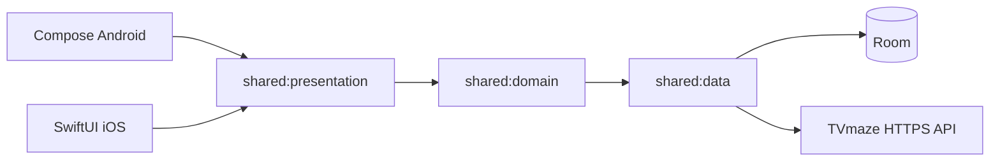

# TV Show Tracker

A cross-platform mobile application built with Kotlin Multiplatform for tracking TV shows, managing favorites, and monitoring episode watch progress.

## Architecture

**Pattern:** MVI (Model-View-Intent) with shared lifecycle-aware ViewModels.



**Structure:**
```
shared/
├── data/
│   ├── remote/        # Ktor API client & DTOs
│   ├── local/         # Room database, DAOs, entities
│   ├── mapper/        # DTO → Domain model mappers
│   └── repository/    # Repository implementations
├── domain/
│   ├── model/         # Domain models (Show, Episode, Season, FavoriteShow)
│   └── repository/    # Repository interfaces
├── presentation/
│   ├── base/          # Lifecycle-backed MVI store
│   ├── search/        # SearchViewModel + State/Intent
│   ├── details/       # DetailsViewModel + State/Intent
│   ├── episodes/      # EpisodesViewModel + State/Intent
│   └── favorites/     # FavoritesViewModel + State/Intent
├── di/                # Koin modules
└── util/              # FlowWrapper for iOS interop

composeApp/            # Android UI (Jetpack Compose)
iosApp/                # iOS UI (SwiftUI)
```

## Tech Stack

| Layer | Technology |
|-------|-----------|
| UI (Android) | Jetpack Compose + Material 3 |
| UI (iOS) | SwiftUI |
| Networking | Ktor Client |
| Database | Room (Multiplatform) |
| DI | Koin |
| Serialization | kotlinx.serialization |
| Image Loading | Coil 3 (Android), AsyncImage (iOS) |
| Logging | Napier |
| Navigation | Type-safe Jetpack Navigation (Android), NavigationStack (iOS) |

## API

Uses [TVmaze API](https://www.tvmaze.com/api) over HTTPS (free public REST API):
- `GET /search/shows?q={query}` - Search shows
- `GET /shows/{id}` - Show details
- `GET /shows/{id}/episodes` - Episode list

## Features

1. **Show Search** - Debounced search with loading/error/empty states
2. **Show Details** - Full show info, poster, genres, rating, favorite toggle, watch progress
3. **Episodes by Season** - Grouped episodes, mark watched/unwatched per episode or season
4. **Favorites (My Shows)** - Offline-available saved shows with progress % and next unwatched episode
5. **Continue Watching** - Calculates next unwatched episode based on season/episode ordering
6. **Light/Dark Mode** - Dynamic Material You colors on Android, system theme on iOS

## Request Efficiency

- In-memory caching for show details and episode lists
- Debounced search (400ms) to avoid excessive API calls
- Episodes cached per show to avoid re-fetching
- Favorites stored locally with Room for offline access

## Networking Choice

**Ktor** was chosen because:
- First-class KMP support with platform-specific engines (OkHttp/Darwin)
- Built-in content negotiation with kotlinx.serialization
- Familiar coroutine-based async API

## Storage Choice

**Room (Multiplatform)** was chosen because:
- Official Google KMP support
- Type-safe DAO queries with Flow
- Familiar API for Android developers
- Handles schema migrations

## Verification

### What is tested:
- **Mapper logic** - DTO to domain model conversions, HTML stripping, null handling
- **SearchViewModel** - Debounce behavior, query changes, error/success states
- **FavoriteShow model** - Progress percentage calculation

### What is NOT tested (and why):
- **UI layer** - No UI testing framework configured; would require Compose testing rules
- **Room DAOs** - Require Android instrumentation tests or Robolectric
- **Ktor API calls** - Would require mock server setup (e.g., MockWebServer)
- **iOS SwiftUI** - No XCTest configured for this project

```bash
./gradlew :shared:compileKotlinMetadata
./gradlew :shared:testDebugUnitTest
./gradlew :composeApp:assembleDebug
./gradlew :shared:linkDebugFrameworkIosSimulatorArm64
```

## Building

### Android
```bash
./gradlew :composeApp:assembleDebug
```

### iOS
Open `iosApp/iosApp.xcodeproj` in Xcode and build, or:
```bash
./gradlew :shared:linkDebugFrameworkIosSimulatorArm64
```

## Requirements

- JDK 17+
- Android Studio / IntelliJ IDEA
- Xcode 15+ (for iOS)
- Kotlin 2.3.21

## Architecture Decisions

- `docs/adr/ADR-001-kmp-mvi.md`
- `docs/adr/ADR-002-network-bound-resource.md`
- `docs/adr/ADR-003-ios-flow-interop.md`
- `docs/adr/ADR-004-type-safe-navigation.md`
